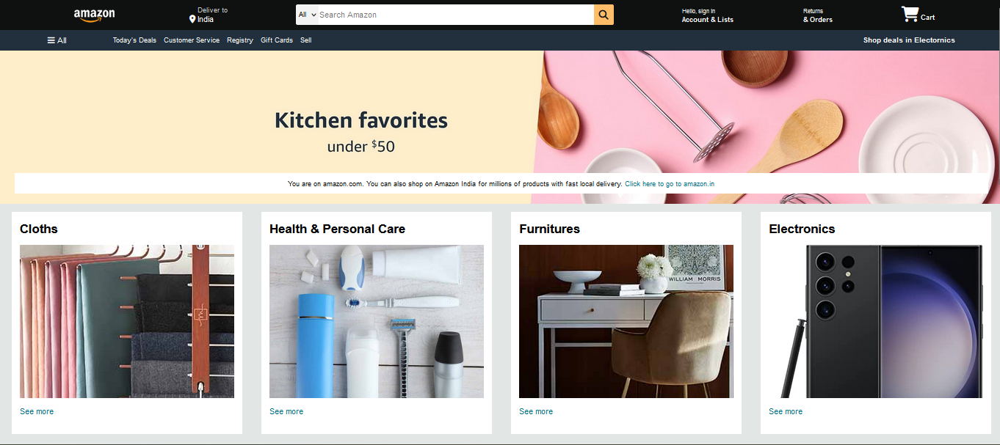

# Amazon-Clone Website

This is a simple HTML and CSS template that resembles the layout of an Amazon-like e-commerce website. The template includes a header, hero section, shop section, and footer.

## Preview



## Features

- Responsive header with navigation links and search bar.
- Hero section with a call-to-action message.
- Shop section with categorized boxes for different product types.
- Footer with links to various sections and copyright information.

## Getting Started

1. Clone or download the repository.

```bash
git clone https://github.com/iam-muzammil-ansari/Amazon-Clone-Website.git
```

2. Open the `index.html` file in a web browser to see the website.


## Customization

- You can modify the images by replacing the `boxX_image.jpg` URLs with your own image URLs.

- Update the text and links in the footer to match your preferences.

## Technologies Used

- HTML
- CSS

## Credits

- The design of this website is inspired by Amazon's layout.


## License

This project is licensed under the MIT License.